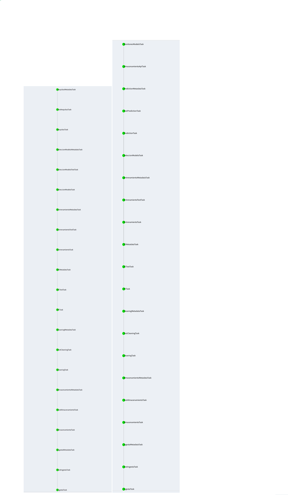

# DPA Food Inspections 2021

* Integrantes del equipo
  * Edgar Bazo
  * Dira Martínez
  * Iván Salgado
  * Ana Torres


* Datos a utilizar: Inspecciones a restaurantes y otros establecimientos en Chicago, estas inspecciones son realizadas por el personal del Programa de Protección de Alimentos del Departamento de Salud Pública de Chicago.

  * **Número de registros:** 215,130 al 15 de enero del 2021
  * **Número de columnas:** 17

    * Inspection ID: Identificador de la inspección

    * DBA Name: 'Doing business as', hace referencia al nombre legal del establecimiento

    * AKA Name: Alias del nombre del establecimiento

    * License #: Número único asignado al establecimiento por parte del Departamento de Asuntos Comerciales y Protección al Consumidor.

    * Facility Type: Tipo de establecimiento, 500 diferentes tipos de establecimientos.

         | Restaurante|Tienda de dulces|Panadería|Cafetería|...|
         |:----------:|:-------------:|:------:|:----------:|:------:|

    * Risk: Cada establecimiento se clasifica según su riesgo de afectar negativamente a la salud pública.

         |Clasificación del riesgo|Descripción|
         |:----|:----|
         |1|Alto|  
         |2|Medio|
         |3|Bajo|
         |All|Todos|

       La frecuencia de inspección está ligada a este riesgo, siendo los establecimientos de riesgo 1 inspeccionados con mayor frecuencia y los de riesgo 3 con      menor frecuencia, la mayoría de las inspecciones tienen riesgo alto.

    * Address: Dirección del establecimiento

    * City: Ciudad estadounidense a la que pertenece el establecimiento, la ciudad que más inspecciones tiene es Chicago.

    * State: Estado al que pertenece el establecimiento, la mayoría de las inspecciones se realizarón en el estado de Illinois, y con un registro en el estado de Nueva York, un registro en el estado de Indiana y un registro en el estado de Wisconsin.

    * Zip: Código postal del establecimiento.

    * Inspection Date: Fecha en la que se realizó la inspección, registros desde el 4 de enero del 2010 hasta el 15 de enero del 2021.

    * Inspection Type: Tipo de inspección, existen 110 tipos de inspección.

        |Tipo de inspección|Descripción|
        |:----|:----|
        |Sondeo|El tipo de inspección más común que se realiza con una frecuencia relativa al riesgo del establecimiento|
        |Consulta| Cuando la inspección se realiza a solicitud del propietario antes de la apertura del establecimiento|
        |Denuncia|Cuando la inspección se realiza en respuesta a una denuncia contra el establecimiento|
        |Licencia|Cuando la inspección se realiza como requisito para que el establecimiento reciba su licencia para operar|
        |Sospecha de intoxicación alimentaria|Cuando la inspección se realiza en respuesta a una o más personas que afirman haberse enfermado como consecuencia de comer en el establecimiento|
        |Inspección del grupo de trabajo|Cuando se realiza una inspección de un bar o taberna. Pueden producirse reinspecciones para la mayoría de estos tipos de inspecciones y se indican como tales|
        |...|...|

    * Results: Resultado de la inspección

        |Resultado|Descripción|
        |:---|:---|
        |Pass|Establecimientos que no tenían violaciones críticas o graves. La mayoría de los establecimientos pasaron la inspección|
        |Fail|Establecimientos que tenían violaciones críticas o graves que no se pudieron corregir durante la inspección. Un establecimiento que recibe una falla no significa necesariamente que la licencia del establecimiento esté suspendida.|
        |Pass w/ Conditions|Establecimientos que tenían violaciones críticas o graves, pero estas se corrigieron durante la inspección|
        |Out of Business|Establecimientos que se encuentran fuera de servicio|
        |No Entry|Establecimientos a los que no se pudieron entrar para realizar la inspección ^|
        |Not Ready|Establecimientos cuyo resultado no está definido ^|
        |Business Not Located|Establecimientos no ubicados|

        ^ Suposición del equipo

    * Violations: Un establecimiento puede recibir una o más de 45 infracciones distintas. Para cada número de infracción enumerado para un establecimiento determinado, se indica el requisito que el establecimiento debe cumplir para que No reciba una infracción, seguido de una descripción específica de los hallazgos que causaron la emisión de la infracción.

        |Infracciones|1-44 y 70|
        |:---:|:---:|

    * Latitude: Coordenada geográfica, latitud del establecimiento.

    * Longitude: Coordenada geográfica, longitud del establecimiento.

    * Location: Latitud y longitud   


* **Pregunta analítica a contestar con el modelo predictivo:** ¿El establecimiento pasará la inspección?


* **Frecuencia de actualización de los datos:** Esta base de datos se actualiza diariamente


* **Dueño de los datos:** Chicago Department of Public Health

   *Información obtenida de [Chicago data portal](https://data.cityofchicago.org/Health-Human-Services/Food-Inspections/4ijn-s7e5)*


* **Infraestructura del proyecto:**

   * Se estará utilizando un entorno virtual _pyenv virtual env_ con la versión de Python 3.7.4
   * Las librerías y sus dependencias que se utilizarán para este proyecto se encuentran en el archivo requirements.txt
   * EL EDA/GDA de los datos se encuentra en la ruta `notebooks/eda.ipynb`, para poder reproducir este notebook se requiere cargar el script `src/utils/utils_notebook/utils_eda.py` y para reproducir la gráfica del mapa de Chicago se deberán de cargar los archivos que se encuentran en la ruta `notebooks/Boundaries - City`
   * En la [wiki](https://github.com/AnaTorresR/DPA-food_inspections/wiki/Bit%C3%A1cora) encontrarás una bitácora de las acciones realizadas en cada checkpoint, así como su fecha de entrega.

 **OJO:** Antes de correr cualquier comando asegúrate de haber instalado la versión actual del requirements.txt de la siguiente manera: `pip install -r requirements.txt` dentro de tu pyenv del proyecto.

 *Credenciales:*

 Para poder realizar la ingesta de datos, tanto histórica como semanal, se deberá solicitar un token en la [API](https://dev.socrata.com/foundry/data.cityofchicago.org/4ijn-s7e5), una vez obtenido el token este se deberá de guardar en la ruta `conf/local/credentials.yaml`, así como tus credenciales de aws para poder acceder a tu bucket s3, este archivo *credentials.yaml* debe ser creado de la siguiente manera:

     ---
     s3:
      aws_access_key_id: "tu-access-key-id"
      aws_secret_access_key: "tu-secret-acces-key"
     food_inspections:
      api_token: "tu-token"

También necesitarás el script `src/utils/constants.py` el cual contiene las siguientes constantes:

    bucket_name = "nombre-de-tu-bucket"
    initial_path = "ingestion/initial/historic-inspections"
    concecutive_path = "ingestion/consecutive/consecutive-inspections"
    dataset_domain = "data.cityofchicago.org"
    dataset_id = "4ijn-s7e5"

En nuestro caso el bucket que ocuparemos lleva el nombre de *'data-product-architecture-equipo-6'*, en tu caso deberás cambiar la constante *bucket_name* al nombre de tu bucket.

*RDS:*

Para continuar con los siguientes pasos del proyecto es necesario contar con una base de datos destinada para el proyecto en una RDS de PostgreSQL. Ten en cuenta que para esto deberás de tener instalado psql en tu computadora. Si no lo tienes instalado, puedes instalarlo copiando y pegando lo siguiente en tu terminal:

               sudo apt install postgresql postgresql-contrib

Una vez que tengas tu RDS, al archivo `credentials.yaml` que creamos anteriormente, es necesario agregarle también las credenciales de nuestra base de datos debajo de las credenciales anteriores, agrégalas de la siguiente manera:

   db:
    user: "nombre-de-tu-usuario"
    pass: "contraseña-de-tu-usuario"
    host: "url-de-tu-base-de-datos"
    port: "5432"
    db: "nombre-de-tu-base-de-datos"

 Además, deberás de crear el archivo `.pg_service.conf` en el `/home` con las siguientes líneas:

    [food]
    user=postgres
    password=aquí-tu-contraseña
    host=endpoint-de-tu-rds
    dbname=aquí-el-nombre-de-tu-base
    port=5432

 En el directorio  se encuentran varios scripts para crear sus correspondientes tablas en PostgreSQL. Para crear estas tablas deberás posicionarte en la raíz del repositorio y ejecutar el siguiente comando en tu terminal:

 ```
 psql -f sql/create_clean_table.sql service=food
 psql -f sql/create_metadata_table.sql service=food
 psql -f sql/create_semantic_table.sql service=food
 psql -f sql/create_tests_table.sql service=food
 psql -f sql/create_results_table.sql service=food
 psql -f sql/create_api_table.sql service=food
 psql -f sql/create_monitoring_table.sql service=food
 ```

 Recuerda que para conectarte a tu base de datos debes correr:

       psql service=food

 Para ver el contenido de cualquier tabla puedes ejecutar lo siguiente desde postgres:

       select * from <esquema>.<tabla>;

* **LUIGI:**

Los tasks creados para este proyecto se encuentran en la ruta `src/pipeline`.

En una terminal activa tu pyenv y ejecuta el comando `luigid`, posteriormente en tu navegador escribe lo siguiente: `localhost:8082`, así podrás ver la DAG de tus tasks. O, si lo estás corriendo desde tu bastión, realiza un port fordwarding de la siguiente manera:

    ssh -i ~/.ssh/id_rsa -NL localhost:<puerto-libre-en-tu-computadora>:localhost:8082 tu-usuario@url-de-tu-bastion

Y abre la interfaz de luigi escribiendo localhost:<puerto-libre-en-tu-computadora> en tu navegador.

En otra terminal, para poder ejecutar estos tasks deberás ubicarte en la raíz de este proyecto y ejecutar los siguientes comandos con tu pyenv activado:

 **Ingesta**

 _Ingesta histórica:_

      PYTHONPATH='.' luigi --module src.pipeline.almacenamiento_task AlmacenamientoTask --ingesta historica --year aaaa --month mm --day dd

 _Ingesta consecutiva:_

    PYTHONPATH='.' luigi --module src.pipeline.almacenamiento_task AlmacenamientoTask --ingesta consecutiva --year aaaa --month mm --day dd

_Metadata Ingesta:_

    PYTHONPATH='.' luigi --module src.pipeline.ingesta_metadata_task IngestaMetadataTask --ingesta <tipo-de-ingesta> --year aaaa --month mm --day dd  

Este primer task obtiene los datos de la API de Food Inspections y son guardados de manera local en formato .pkl en la ruta `temp/data-product-architecture-equipo-6/ingestion/ 'la ingesta que corriste'/ 'la ingesta que corriste'-inspections-aaaa-mm-dd.pkl`. Esta carpeta es generada de manera automática por este task.

La ingesta consecutiva se estará ejecutando semanalmente, tomará la fecha del día de ejecución (t) y se le restarán 7 días, lo cual extraerá los registros al tiempo (t-1).

__------------->__ Por la forma en la que está construida la task de ingesta consecutiva, para evitar la duplicación u omisión de observaciones. Se debe ejecutar cada 7 días a la misma hora, o si es la primera consecutiva, 7 días después de la histórica.      

 **Almacenamiento**

 _Almacenamiento Task_
 
       PYTHONPATH='.' luigi --module src.pipeline.almacenamiento_task AlmacenamientoTask --ingesta <tipo de ingesta> --year aaaa --month mm --day dd

_Metadata Almacenamiento:_

       PYTHONPATH='.' luigi --module src.pipeline.almacenamiento_metadata_task AlmacenamientoMetadataTask --ingesta <tipo-de-ingesta> --year aaaa --month mm --day dd  

Este task guarda el .pkl generado en el task anterior en tu bucket s3 en la siguiente ruta `ingestion/initial/historic-inspections-aaaa-mm-dd.pkl` si corriste ingesta histórica y `ingestion/consecutive/consecutive-inspections-aaaa-mm-dd.pkl` si corriste ingesta consecutiva.

 **Pre-processing / Cleaning**

 + _cleaning_task.py_ : Contiene el task _CleaningTask_ que lee los datos resultantes del proceso de ingesta del bucket de s3, les hace una serie de transformaciones de limpieza y finalmente, sube los datos limpios a la base de datos a la tabla de `features` dentro del esquema `clean`.

 _Limpieza Task:_

      PYTHONPATH='.' luigi --module src.pipeline.cleaning_task CleaningTask --ingesta <tipo-de-ingesta> --year aaaa --month mm --day dd

_Metadata Limpieza:_

      PYTHONPATH='.' luigi --module src.pipeline.cleaning_metadata_task CleaningMetadataTask --ingesta <tipo-de-ingesta> --year aaaa --month mm --day dd

Si deseas ver los datos limpios conéctate a tu base de datos como se mencionó anteriormente y ejecuta el siguiente comando:

        select * from clean.features;

Esta tabla fue creada gracias al script [sql/create_clean_table.sql](https://github.com/AnaTorresR/DPA-food_inspections/blob/main/sql/create_clean_table.sql)

**Feature Engineering**

 + _feature_engineering_task.py_ : Incluye el task _FETask_ la cual lee los datos limpios de `clean.features` y realiza las transformaciones necesarias para la ingeniería de características para después subir los datos transformados a la tabla `features` del esquema `semantic`.

 _Feature Engineering Task:_

      PYTHONPATH='.' luigi --module src.pipeline.feature_engineering_task FETask --ingesta <tipo-de-ingesta> --year aaaa --month mm --day dd

 _Metadata Feature Engineering:_

      PYTHONPATH='.' luigi --module src.pipeline.feature_engineering_metadata_task FEMetadataTask --ingesta <tipo-de-ingesta> --year aaaa --month mm --day dd

Si deseas ver los datos de la tabla semantic.features ejecuta el siguiente comando dentro de tu base de datos:

      select * from semantic.features;

Esta tabla fue creada gracias al script [sql/create_semantic_table.sql.sql](https://github.com/AnaTorresR/DPA-food_inspections/blob/main/sql/create_semantic_table.sql)

**Entrenamiento**

+ _entrenamiento_task.py_: Incluye el task _EntrenamientoTask_ el cual lee los datos de la tabla semantic.features de una semana anterior hasta la fecha en la que se está corriendo este task. Transforma los datos para poder modelarlos y son guardados en el bucket s3 en la siguiente ruta `ingestion/consecutive/consecutive-inspections-aaaa-mm-dd-train.pkl` si corriste ingesta consecutiva y `ingestion/initial/historic-inspections-aaaa-mm-dd-train.pkl` si corriste ingesta histórica.

_Entrenamiento:_

    PYTHONPATH='.' luigi --module src.pipeline.entrenamiento_task EntrenamientoTask --ingesta <tipo-de-ingesta> --year aaaa --month mm --day dd

_Metadata Entrenamiento:_

    PYTHONPATH='.' luigi --module src.pipeline.entrenamiento_metadata_task EntrenamientoMetadataTask --ingesta <tipo-de-ingesta>  --year aaaa --month mm --day dd


**Selección del Modelo**

+ _seleccion_modelo_task.py_: Incluye el task _SeleccionModeloTask_ el cual lee el .pkl de entrenamiento previamente guardado por el task anterior en el bucket y entrena 12 diferentes bosques aleatorios con la función `modeling(df)` que se encuentra en el script [src/utils/general.py](https://github.com/AnaTorresR/DPA-food_inspections/blob/main/src/utils/general.py). El mejor modelo es guardado en formato .pkl el el bucker s3 bajo la siguiente ruta `ingestion/consecutive/consecutive-inspections-aaaa-mm-dd-modelo.pkl` si corriste ingesta consecutiva y `ingestion/initial/historic-inspections-aaaa-mm-dd-modelo.pkl` si corriste ingesta histórica.

_Selección Modelo:_

    PYTHONPATH='.' luigi --module src.pipeline.seleccion_modelo_task SeleccionModeloTask --ingesta <tipo-de-ingesta>  --year aaaa --month mm --day dd

_Metadata Selección Modelo:_

    PYTHONPATH='.' luigi --module src.pipeline.seleccion_modelo_metadata_task SeleccionModeloMetadataTask --ingesta <tipo-de-ingesta> --year aaaa --month mm --day dd

**Aequitas**

Este proyecto es considerado **asistivo**, debido a que los dueños de los establecimientos podrán observar a través de nuestra API (lista para el 25 de mayo) si su establecimiento pasará o no la inspección, por lo que podrán tomar las medidas necesarias para que el establecimiento pase la inspección el día que se les asigne.

Los grupos de referencia son los siguientes:

 |Variable|Grupo|
 |:---:|:---:|
 |Tipo de establecimiento|Restaurante|
 |Riesgo| 1. Alto |
 | Tipo de inspección|Canvass|

La razón por la que seleccionaos estos grupos de referencia es porque son las categorías con la mayor frecuencia en nuestros datos. Lo puedes ver nuestro [EDA](https://github.com/AnaTorresR/DPA-food_inspections/blob/main/notebooks/eda.ipynb)

Las métricas consideradas en este proyecto serán:

   **FNR**: Nos interesa saber si los establecimientos que pasaron la inspección cuántas de esas veces nos equivocamos en la predicción debido al tipo de establecimiento.

   **FOR**: Nos interesa conocer si hay un sesgo hacia algún grupo de no ser seleccionado como etiqueta positiva.

 _Aequitas:_
 
    PYTHONPATH='.' luigi --module src.pipeline.aequitas_task AequitasTask --ingesta <tipo-de-ingesta> --year aaaa --month mm --day dd --model-type assistive

O puedes omitir el parámetro `model-type` pues nuestro pipeline tiene el valor _assistive_ por default.

_Metadata Aequitas:_

    PYTHONPATH='.' luigi --module src.pipeline.aequitas_metadata_task AequitasMetadataTask --ingesta <tipo-de-ingesta> --year aaaa --month mm --day dd --model-type assistive

Esta tabla de métricas son guardadas en el bucket s3 bajo la ruta `ingestion/consecutive/consecutive-inspections-aaaa-mm-dd-aequitas.pkl` si corriste ingesta consecutiva y `ingestion/initial/historic-inspections-aaaa-mm-dd-aequitas.pkl` si corriste ingesta histórica.

**Predicciones**

+ _prediction_task.py_: está conformado por el task _PredictionTask_ el cual requiere de los datos generados en el task de feature engineering así como la selección del modelo previamente guardado en el bucket s3.

Se generan las predicciones del conjunto de prueba, se crea una nueva etiqueta con un theshold de 0.6652 (decisión tomada previamente) y se guardan en la tabla `results.predictions` junto con la etiqueta original, la fecha en la que se están haciendo las predcciones, el modelo con el que se crearon estos resultados, entre otras variables que describen a los establecimientos.

Si deseas ver los datos que se encuentran en la tabla, ejecuta el siguiente comando dentro de tu base de datos:

     select * from results.predictions;

_Predicciones:_

    PYTHONPATH='.' luigi --module src.pipeline.prediction_task PredictionTask --ingesta <tipo-de-ingesta> --year aaaa --month mm --day dd

_Metadata Predicciones:_

    PYTHONPATH='.' luigi --module src.pipeline.prediction_metadata_task PredictionMetadataTask --ingesta <tipo-de-ingesta> --year aaaa --month mm --day dd --model-type assistive


Todos estos módulos mencionados tienen asociados tasks de Metadata, los cuales se encargan de escribir la metadata relevante de cada una de sus correspondientes tareas en la tabla de `metadata` en la base de datos. Esta metadata relevante incluye: tipo de task, tipo de ingesta, fecha de ejecución y autor.

**Almacenamiento API y Monitoreo Modelo**

Estos últimos tasks generan las tablas `api.scores` y `monitoring` las cuales son similares a la tabla `results.predictions`.
La razón de estas dos nuevas tablas es por que queremos que el pipeline de predicciones y el monitoreo del modelo así como la API funcionen de manera independiente.

_Almacenamiento API:_

    PYTHONPATH='.' luigi --module src.pipeline.almacenamiento_api_task AlmacenamientoApiTask --ingesta <tipo-de-ingesta> --year aaaa --month mm --day dd --model-type assistive

_Monitoreo Modelo:_

    PYTHONPATH='.' luigi --module src.pipeline.monitoreo_modelo_task MonitoreoModeloTask --ingesta <tipo-de-ingesta> --year aaaa --month mm --day dd --model-type assistive

*Pruebas Unitarias*

Se crearon pruebas unitarias enfocadas a los datos para cada una de las tareas del pipeline (excepto Almacenamiento Api y Monitoreo Modelo). Estas pruebas tienen el objetivo de verificar la integridad de los datos que ingestamos y que estos sean congruentes con los datos anteriores, para asegurar que si alguna tarea falla no sea por los datos si no por la estructura de nuestros pipelines. Estas pruebas unitarias también fallan si se intenta ingestar con una fecha futura o si se indica en el test de aequitas que el modelo es punitvo.

+ Test Ingesta y Test Almacenamiento:
     + Verifica si existe el archivo guardado en la carpeta temporal `temp`.
     + Verifica si existen los 4 tipos de riesgos en los datos ingestados.
     + Verifica que la variable `inspection_date` tenga fechas coherentes.
     + Verifica que el archivo guardado en la carpeta temporal no esté vacío.
     + Verifica que se esté realizando ingesta de datos de fechas ya ocurridas.

* Test Cleaning:
     + Verifica que todos los registros estén en minúsculas.
     + Verifica que el número de columnas sean exactamente 16.
     + Verifica que se esté realizando ingesta de datos de fechas ya ocurridas.

* Test Feature Engineering y Entrenamiento:
     + Verifica que los datos tengan más de una columna.
     + Verifica que los datos tengam más de un registro.
     + Verifica que se esté realizando ingesta de datos de fechas ya ocurridas.

* Test Selección Modelo:
     + Verifica que el tamaño del archivo guardado como el mejor modelo en el bucket S3 sea mayor a 0 bytes.
     + Verifica que se esté realizando ingesta de datos de fechas ya ocurridas.

* Test Aequitas:
     + Verifica que el análisis de sesgo e inequidad se realice para 3 tipos de atributos (facility_type, risk e inspection_type)
     + Verifica que la tabla resultante contenga 4 métricas para cada grupo ('for_disparity', 'fnr_disparity', 'tpr_disparity','fnr_disparity')
     + Verifica que la tabla resultante no esté vacía.
     + Verifica que sólo se realice el análisis para fechas ya ocurridas.
     + Verifica que el modelo sea de tipo asisitivo con el parámetro ``model-type``.

* Test Predicciones:
     + Verifica que las etiquetas predichas sean únicamente 0 ó 1.
     + Verifica que los scores predichos estén entre 0 y 1.
     + Verifica que las etiquetas reales (ground truth) sean únicamente 0 ó 1.
     + Verifica que el número de columnas en la tabla de predicciones sean exactamente 14.
     + Verifica que la tabla de predicciones no esté vacía.
     + Verifica que no existan valores nulos en las columnas de `id_inspection`, `score`, `label`, `ground_truth` en la tabla de predicciones.
     + Verifica que el modelo sea de tipo asisitivo con el parámetro ``model-type``.

 * **DAG**

